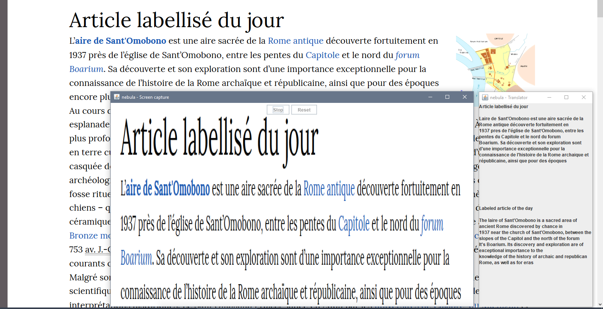

# nebula
Nebula is a Screen capture/ocr/translator combo primarily intended to be used as a live translator for chat sessions.

## Usage
Drag your mouse to select a smaller area on the screen from the recording and press start.

## Build
**Note:** Before compiling an API key from Microsoft needs to be put in `src/main/resources/key.txt` for the translation API. See [documentation](https://docs.microsoft.com/en-us/azure/cognitive-services/translator/translator-text-how-to-signup) on how to obtain a key.
